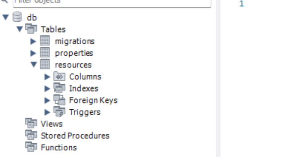

作成手順

## .envrc の導入 (インフラと分岐するときは gitignore)
```sh
$ direnv edit .
```

## mysql のセットアップ
```sh
# dbconfig.ymlの 以下の出力先を変更する
dir: boiler2/migrations 
```

```sh
$ sql-migrate new MIGRATEFILENAME
```

```sh
$ make up
docker compose -f database/docker-compose.yml up --force-recreate -d
[+] Running 12/12
 ✔ db 11 layers [⣿⣿⣿⣿⣿⣿⣿⣿⣿⣿⣿]      0B/0B      Pulled                                                                  22.3s 
   ✔ e54b73e95ef3 Pull complete                                                                                        3.5s 
   .....
```



## sql boiler のセットアップ

### boiler に移動
```sh
$ cd boiler
```

```sh
$ make buf-gen
```

###  [sql-migrate](https://github.com/rubenv/sql-migrate)

```sh
$ make migrate-up
```

### boiler の mysql のコード生成
```sh
$ make boiler-gen
```

### コマンド実行
```sh
$ go run main.go
```

